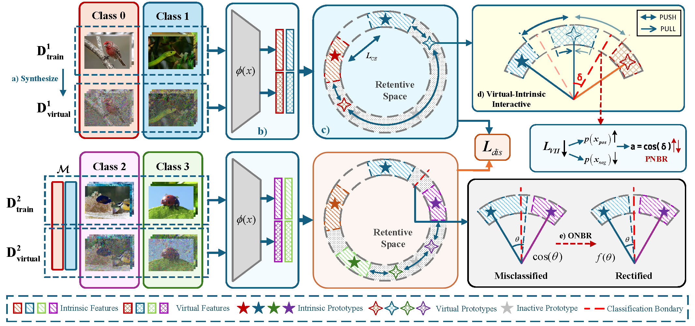

<h1 align="center" style="font-size: 42px; font-weight: bold; margin-bottom: 20px;">
  Evolving from Unknown to Known: Retentive Angular Representation Learning for Incremental Open Set Recognition (ICCVW'25)
</h1>

  <b>Runqing Yang</b> &emsp; <b>Yimin Fu</b> &emsp; <b>Changyuan Wu</b> &emsp; <b>Zhunga Liu</b>

  

  This is the code implementation of "Evolving from Unknown to Known: Retentive Angular Representation Learning for Incremental Open Set Recognition"(https://arxiv.org/abs/2509.06570).

  ⏳ This work is being extended to a journal version. The full code will be released upon the acceptance of the journal publication.

